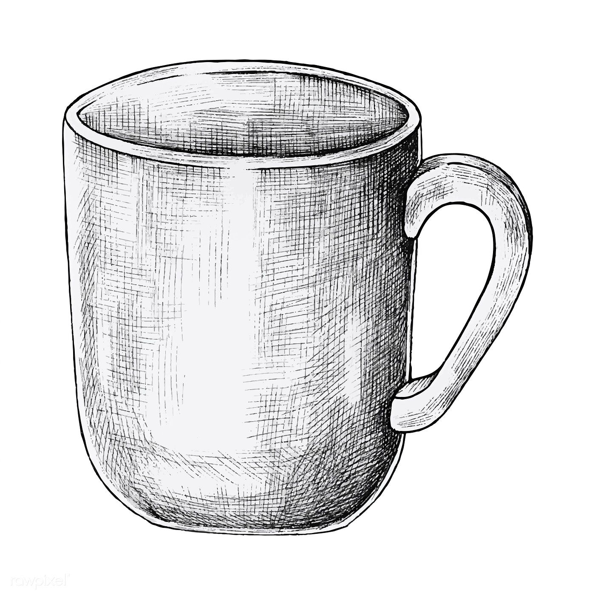
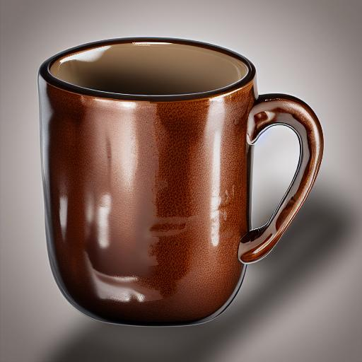

# Sketch-to-Photo Translation

<div align="center">
  <table>
    <tr>
      <td align="center">
        
        <br />Input sketch
      </td>
      <td align="center">
        
        <br />Generated result
      </td>
    </tr>
  </table>
</div>

Converts a sketch (object, animal, architecture) into a photorealistic image using pretrained ControlNet (SoftEdge) + Stable Diffusion 1.5, with optional LoRA fine-tuning for domain-specific improvements.

## Pipeline

1. **Preprocess** (`preprocess_sketch.py`) — cleans and resizes the sketch
2. **Inference** (`run_controlnet.py`) — extracts a softedge map (PidiNet) and generates a photorealistic image via ControlNet + SD1.5
3. **LoRA training** (`train_lora.py`, optional) — fine-tunes the UNet if pretrained output isn't sufficient

## Setup

```bash
pip install diffusers transformers accelerate xformers controlnet_aux peft --break-system-packages
```

## Usage

**1. Preprocess a sketch**
```bash
python preprocess_sketch.py --input sketch.jpg --output processed.jpg --denoise --no_pad
```
- `--denoise`: apply denoising (recommended for scanned/hand-drawn sketches)
- `--no_pad`: direct resize to 512x512 instead of aspect-preserving pad (avoids frame artifacts in generation; use this by default)
- `--adaptive_thresh`: binarize the sketch — only use if targeting `lineart`/`scribble` ControlNet models, not `softedge`

**2. Generate the photorealistic image**
```bash
python run_controlnet.py --input processed.jpg --output result.jpg \
  --prompt "a photorealistic ceramic coffee mug, studio product photography, soft lighting, plain background, high detail"
```
Key params:
- `--conditioning_scale` (default 1.2): how strongly the output follows the sketch structure
- `--steps` (default 35): diffusion steps
- `--lora_path`: local path or Hugging Face repo id of a LoRA to load (optional)

Base model: `SG161222/Realistic_Vision_V5.1_noVAE`
ControlNet: `lllyasviel/control_v11p_sd15_softedge`

## Notes from experiments

- Use the **non-thresholded**, denoised sketch for softedge conditioning — thresholded/binarized input causes a mismatch with PidiNet (trained on natural grayscale), producing noisy/artifacted output.
- Avoid hard-edge padding (white or black canvas borders) — it creates a strong edge that ControlNet renders as a literal frame or texture (e.g. wood-grain background artifact). Direct resize (`--no_pad`) avoids this.
- `conditioning_scale=1.2` and `steps=35` gave clean, structurally accurate results across architecture and object sketches without further tuning.
- Realistic Vision (a photorealism-focused SD1.5 checkpoint) outperforms the base `runwayml/stable-diffusion-v1-5` for this task with no training required.

## When to train a LoRA

Skip LoRA if pretrained output already looks correct (this was sufficient for general object sketches in testing — mug, sneaker, watch, backpack all worked well pretrained-only).

Train a LoRA when:
- Output for your specific domain (e.g. only faces, only a narrow style) consistently looks off despite prompt/conditioning-scale tuning
- You want output to match a specific consistent visual style not achievable via prompting alone

### LoRA training steps

1. **Prepare a dataset** in this structure:
   ```
   my_dataset/
     images/          # target photos (.jpg)
     conditioning/     # softedge maps of those same photos (generate with PidiNet, same as inference)
     captions.txt      # one caption per line, matching image order
   ```
   Conditioning maps must be generated the same way as at inference time (PidiNet softedge) so training and inference distributions match.

   **If the sketch domain is unusual** (not a common object type SD/Realistic Vision has seen a lot of — e.g. specialized equipment, fictional/stylized objects, niche product categories):
   - Realistic Vision's base knowledge of that object type is likely weak or absent, so prompting alone won't fix it — this is the case LoRA is actually for.
   - Dataset needs 20-50+ diverse photos of that object type (different angles/lighting) for the LoRA to learn its visual characteristics, not just 2-3 examples.
   - Captions should consistently describe the object with the same key term(s) (e.g. always call it "a widget-X") so the LoRA associates that token with the learned features.
   - Consider a higher `--rank` (16-32 instead of 8) if the object's visual structure is complex/unfamiliar to the base model — more capacity to learn new visual concepts.

2. **Run training:**
   ```bash
   python train_lora.py --data_dir ./my_dataset --output_dir ./lora_output --epochs 10
   ```
   Adjustable: `--rank` (LoRA rank, default 8), `--alpha` (default 16), `--lr` (default 1e-4), `--batch_size` (default 1, keep low for 8GB VRAM)

   Only LoRA adapter weights on the UNet's attention layers (`to_q`, `to_k`, `to_v`, `to_out.0`) are trained — VAE, text encoder, and ControlNet stay frozen.

3. **Use the trained LoRA at inference:**
   ```bash
   python run_controlnet.py --input processed.jpg --output result.jpg --prompt "..." --lora_path ./lora_output
   ```
   `--lora_path` also accepts a Hugging Face repo id directly, for using someone else's pretrained LoRA instead of training your own.

## Files

| File | Purpose |
|---|---|
| `preprocess_sketch.py` | OpenCV sketch cleanup/resize |
| `run_controlnet.py` | ControlNet + SD1.5 inference, with optional LoRA loading |
| `train_lora.py` | LoRA fine-tuning on the UNet (untested against real data — validate before relying on it) |